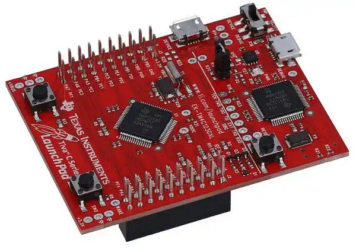

> **NOTE**
This file is best viewed in a **markdown viewer**, such as the one built into GitHub. Markdown viewers are also available as plug-ins to popular Internet browsers.

# Low-Power Example on EK-TM4C123GXL
This example demonstrates the [low-power application](https://www.state-machine.com/qpc/tut_low.html) on the EK-TM4C123GLX board (ARM Cortex-M4F).

<p align="center">
<br>
<b>EK-TM4C123GXL (TivaC LaunchPad)</b>
</p>

## Example Behavior
The the low-power example illustrates the use of **two** clock tick rates to toggle the LEDs available on the EK-TM4C123GXL board. After the application code is loaded to the board, the Green-LED starts blinking once per two seconds (a second on and a second off), while the Red-LED lights up and stays on. If no buttons on the board are pressed, the Green-LED stops blinking after 4 times. The Red-LED shows the idle condition, where the system is in a sleep mode.

When your press the SW1-Button, the Green-LED starts blinking as before, but additionally, the Blue-LED starts blinking rapidly for 13 times (1/10 of a second on and 1/10 off).

So, depending when the SW1 switch is pressed, you can have only Green-LED blinking, or both green and blue blinking at different rates. The Red-LED appears to be on all the time.

> **Note**<br>
Actually, the Red-LED is also turned off for very brief moments, but this is imperceptible to the human eye. Instead, the Red-LED appears to be on all the time, which corresponds to the application being mostly idle.

The behavior just described is designed for the slow human interaction with the application. However, for more precise measurements with a __logic analyzer__, it is more convenient to speed up the application by factor of 100. This speed up can be achieved by editing the bsp.h header file:


# Code Organization
```
qpc|qpcpp/                    // QP/C/C++ installation directory
 +-examples/                  // QP/C/C++ examples directory (application)
 | +-arm-cm/                  // QP/C/C++ examples for ARM Cortex-M
 | | +-low-power_ek-tm4c123gxl/ // Low-Power example on the EK-TM4C123GLX board
 | | | +-qk/      //----------- Projects for the preemptive QK kernel
 | | | | +-arm/               // ARM-KEIL toolchain
 | | | | |   low-power-qk.uvprojx // uVision project
 | | | | +-gnu/               // GNU-ARM toolchain
 | | | | |   Makefile         // Makefile for building the project
 | | | | +-iar/               // IAR-ARM toolchain
 | | | |     low-power-qk.eww // IAR EW-ARM workspace
 | | | |     bsp.c            // BSP for the QK kernel
 | | | +-qv/      //----------- Projects for the non-preemptive QV kernel
 | | | | +-arm/               // ARM-KEIL toolchain
 | | | | |   low-power-qv.uvprojx // uVision project
 | | | | +-gnu/               // GNU-ARM toolchain
 | | | | |   Makefile         // Makefile for building the project with GNU-ARM
 | | | | +-iar/               // IAR-ARM toolchain
 | | | |     low-power-qk.eww // IAR EW-ARM workspace
 | | | |     bsp.c|.cpp       // BSP for the QV kernel
 | | | +-qxk/     //----------- Projects for the dual-mode QXK kernel
 | | | | +-arm/               // ARM-KEIL toolchain
 | | | | |   low-power-qxk.uvprojx // uVision project
 | | | | +-gnu/               // GNU-ARM toolchain
 | | | | |   Makefile         // Makefile for building the project
 | | | | +-iar/               // IAR-ARM toolchain
 | | | |    low-power-qxk.eww // IAR EW-ARM workspace
 | | | |    bsp.c|.cpp        // BSP for the QxK kernel
 | | | |    xblinky1.c|.cpp   // eXtended thread for the QXK kernel```
```

# Building the example

## GNU/ARM
- open terminal window
- change to the desired directory (either `examples\arm-cm\dpp_ek-tm4c123gxl\qk\gnu`, `examples\arm-cm\dpp_ek-tm4c123gxl\qv\gnu`, or `examples\arm-cm\dpp_ek-tm4c123gxl\qxk\gnu`)
- to build the default Debug configuration, type:

```
make
```

> **NOTE**
The `make` utility for Windows is provided in the QTools collection for Windows.

- to build the Release configuration, type:

```
make CONF=rel
```

- to build the Spy configuration, type:

```
make CONF=spy
```


### ARM/KEIL MDK
- Open the provided KEIL uVision project (either `dpp-qk.uvprojx`, `dpp-qv.uvprojx`, or `dpp-qxk.uvprojx`)
in Keil uVision IDE. Build/Debug/Download to the board from the IDE.
- Change the build configuration in the "Project Target" drop-down menu.


### IAR EWARM
- Open the provided IAR EWARM workspace (either `dpp-qk.eww`, `dpp-qv.eww`, or `dpp-qxk.eww`)
in IAR EWARM IDE. Build/Debug/Download to the board from the IDE.
- Change the build configuration in the "Project Configuration" drop-down menu.

