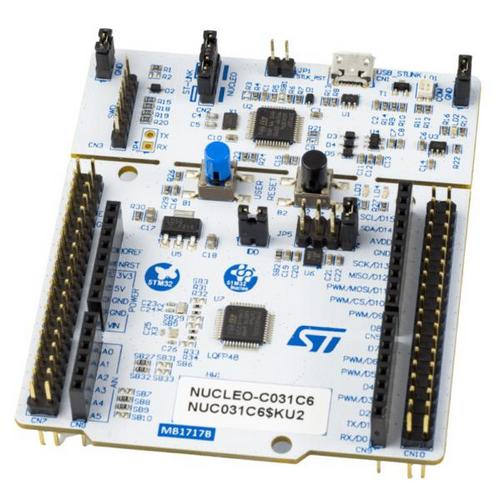

# About this project

This project is for STM32Cube IDE with CubeMX and the
NUCLEO-C031C6 board:



This project demonstrates:
- Using the QP/C Framework from the CMSIS-pack
  + Using the preemptive, non-blocking QK kernel
- DPP (Dining Philosopher Problem) example application
  + code generated from a QM model, which can be edited manually,
    or with graphical QM modeling tool.
- Debug configuration
- Spy configuration with software tracing


# Steps to use this project

1. Choose menu: "File | Open Projects from File System..."
2. In the Project Explorer select (double-click) on the file "project.ioc"
3. Choose menu: "Project | Generate Code"
   - this will create directory `Middlewares` in the project directory
4. Build the project (click the "hammer" tool in the toolbar)
5. Connect the NUCLEO-C031C6 board and Run/Debug the project


# Using the Spy configuration

1. Click on the down-arrow on the "hammer" tool and choose "Spy"
2. Click on "Debug configurations" button and choose "Debug Configurations..."
3. Choose or create the "project Spy" debug configuration
4. Open a terminal window and type "qspy -c <COMX>", where <COMX> is the serial
   port of your NUCLEO-C031C6 board
5. Start debugging / run the program
6. The qspy window should start showing the output.


# Modifying the example

The example code is located in the `Core` sub-folder:

```
\---Core
    |   dpp.qm
    |
    +---Inc
    |       bsp.h
    |       dpp.h
    |       main.h
    |       RTE_Components.h
    |       stm32c0xx_hal_conf.h
    |       stm32c0xx_it.h
    |       stm32c0xx_nucleo_conf.h
    |
    +---Src
    |       bsp.c
    |       main.c
    |       philo.c
    |       stm32c0xx_hal_msp.c
    |       stm32c0xx_it.c
    |       syscalls.c
    |       sysmem.c
    |       system_stm32c0xx.c
    |       table.c
```

The example code can be edited manually, as any regular C code.

However, it is also possible (and recommended) to model the application
graphically by means of the QM modeling tool and then **generate** the
code automatically. The example model is located in the file `Core/dpp.qm`.
