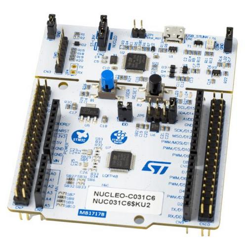

# About this project

This project is for KEIL uVision IDE with the GNU-ARM compiler,
and the NUCLEO-C031C6 board:



This project demonstrates:
- Using the QP/C Framework from the CMSIS-pack
  + Using the preemptive, non-blocking QK kernel
- DPP (Dining Philosopher Problem) example application
  + code generated from a QM model, which can be edited manually,
    or with graphical QM modeling tool.
- Debug configuration
- Spy configuration with software tracing


# Steps to use this project
This project requires external GNU-ARM compiler installation.
The configuration in the project assumes the GNU-ARM toolchains from
the QTools collection for Windows, which is typically located installation

`C:\qp\qtools\gnu_arm-none-eabi\`

However, other GNU-ARM toolchain can be used as well. The location
of the GNU-ARM toolchain can be configured in KEIL IDE by clicking on

0. Select menu: "Project | Manage -> Project Items...".
   - click on the "Folders/Extensions" tab
   - tick the box "Use GCC Compiler (GNU) for ARM projects
   - configure the "Prefix"
   - configure the "Folder"

After you configure the GNU-ARM toolchain, do the following:

1. Open the `project.uvprojx` in KEIL uVision IDE
2. Build the project (default `dbg` configuration)
5. Connect the NUCLEO-C031C6 board and Run/Debug the project


# Using the Spy configuration

1. Select the `spy` target from the drop-down menu in the top toolbar
2. Build the project (`spy` configuration)
4. Open a terminal window and type "qspy -c <COMX>", where <COMX> is the serial
   port of your NUCLEO-C031C6 board
5. Start debugging / run the program
6. The qspy window should start showing the output.


# Modifying the example

The example code is located in the project folder:

```
dpp_nucleo-c031c6-qk-keil
|
|   bsp.c
|   bsp.h
|   dpp.h     <-- generated
|   dpp.qm    <-- QM model file
|   main.c
|   philo.c   <-- generated
|   project.sct
|   project.uvoptx
|   project.uvprojx
|   README.md
|   table.c   <-- generated
|
\---RTE
    +---Device
    |   \---STM32C031C6Tx
    |           . . .
```

The example code can be edited manually, as any regular C code.

However, it is also possible (and recommended) to model the application
graphically by means of the QM modeling tool and then **generate** the
code automatically. The example model is located in the file `Core/dpp.qm`.
