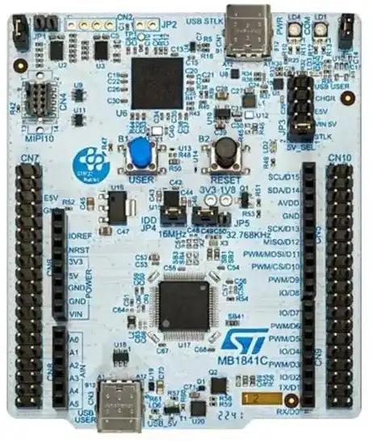

# About this project
This project is for STM32Cube IDE with CubeMX and the
**NUCLEO-U545RE-Q** board:

<p align="center">
<br>
<b>STM32 NUCLEO-U545RE</b>
</p>

This project demonstrates:
- Using the QP/C Framework from the CMSIS-pack
  + Using the preemptive, non-blocking QK kernel
- DPP (Dining Philosopher Problem) example application
  + code generated from a QM model, which can be edited manually,
    or with graphical QM modeling tool.
- Debug configuration
- Spy configuration with software tracing

# Registering the qpc Package with STM32Cube

The project is based on the `QuantumLeaps.qpc` Software Package,
which needs to be registeed with STM32Cube IDE. This can be done
as follows:

1. Choose menu: "Help | Manage Embedded Software Packages"
   which opens the "Embedded Software Package Manager" application.
2. In "Embedded Software Package Manager", click the "From Url..."
   button at the bottom.
3. In the "User Defined Packs Manager" dialog box, click the "New"
   button at the bottom.
4. In the "Add new Url" box, copy-and-paste the following URL:

https://raw.githubusercontent.com/QuantumLeaps/cmsis-packs/main/QuantumLeaps.pidx

Click "Check" and then click "OK"

# Steps to use this project

1. Choose menu: "File | Open Projects from File System..."
2. In the Project Explorer select (double-click) on the file "project.ioc"

> **NOTE** If you are opening the project for the first time, STM32Cube
will present a warning: "the CMSIS-Pack: QuantumLeaps.qpc._version_ is not
present on the repository or user disk". Please select the option:
"Download now".

3. Choose menu: "Project | Generate Code"
   - this will create directory `Middlewares` in the project directory
4. Build the project (click the "hammer" tool in the toolbar)
5. Connect the NUCLEO-U545RE-Q board and Run/Debug the project


# Using the Spy configuration
> **NOTE** Due to the widespread non-compliance with the GPL, as well as
infringement on the dual-licensing model of QP frameworks, the QS target-
resident component has been removed from the open-source GPL distribution.
To request evaluation of the complete QP/C framework, please contact
Quantum Leaps at: https://www.state-machine.com/contact.


1. Click on the down-arrow on the "hammer" tool and choose "Spy"
2. Click on "Debug configurations" button and choose "Debug Configurations..."
3. Choose or create the "project Spy" debug configuration
4. Open a terminal window and type "qspy -c <COMX>", where <COMX> is the serial
   port of your NUCLEO-U545RE-Q board
5. Start debugging / run the program
6. The qspy window should start showing the output.


# Modifying the example

The example code is located in the `Core` sub-folder:

```
\---Core
    |   dpp.qm  <== QM model of the DPP application
    |
    +---Inc
    |       bsp.h
    |       dpp.h    <== generated by QM
    |       main.h
    |       RTE_Components.h
    |       stm32u5xx_hal_conf.h
    |       stm32u5xx_it.h
    |       stm32u5xx_nucleo_conf.h
    |
    +---Src
    |       bsp.c
    |       main.c
    |       philo.c  <== generated by QM
    |       stm32u5xx_hal_msp.c
    |       stm32u5xx_it.c
    |       syscalls.c
    |       sysmem.c
    |       system_stm32u5xx.c
    |       table.c  <== generated by QM
    ...
```

The example code can be edited manually, as any regular C code.

However, it is also possible (and recommended) to model the
application graphically by means of the
[QM modeling tool](https://github.com/QuantumLeaps/qm)
and then **generate** the code automatically. The example model
is located in the file `Core/dpp.qm`.
