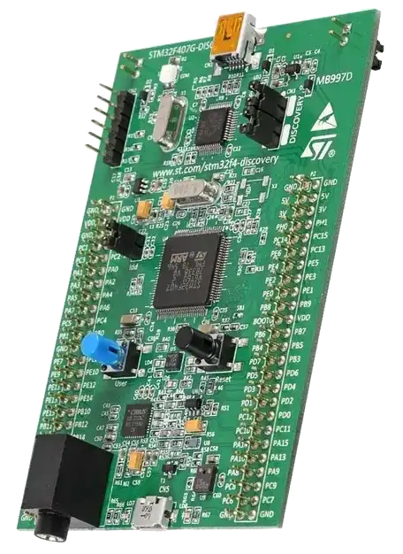
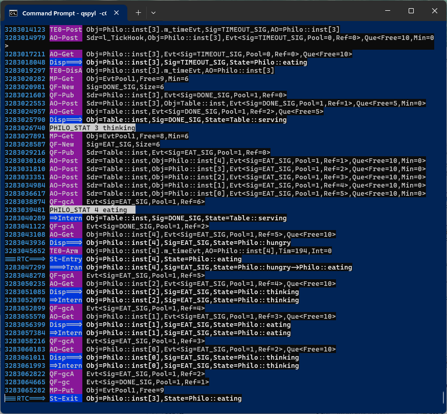

> **NOTE**
This file is best viewed in a **markdown viewer**, such as the one built into GitHub. Markdown viewers are also available as plug-ins to popular Internet browsers.

# DPP on STM32F4-Discovery
This example demonstrates QP port to the FreeRTOS on the STM32 STM32F4-Discovery board (ARM Cortex-M7).

<p align="center">

</p>

The example uses the [Dining Philosophers Problem (DPP) application](https://www.state-machine.com/qpc/tut_dpp.html)

<p align="center">
<br>
<b>STM32F4-Discovery</b>
</p>

## Features Demonstrated
- QP port to FreeRTOS
  + with GNU-ARM toolchain
  + with Keil-MDK toolchain
  + with IAR-ARM toolchain
- multiple cooperating active objects
- immutable (const) events
- mutable (dynamic) events
- time events
- direct event posting
- publish-subscribe event delivery


## Build Configurations
- Debug
- Release
- Spy - [software tracing with the USART2](#tracing-with-qpspy)

# Code Organization
```
examples\freertos\dpp_stm32f4-discovery
|   |
|   +---armclang        // Keil-MDK toolchain
|   |       . . .
|   |       dpp.uvprojx // Keil uVision project
|   +---gnu             // GNU-ARM toolchain
|   |       . . .
|   |       Makefile    // Makefile for GNU-ARM
|   \---iar             // IAR EWARM
|           dpp.eww     // IAR EW-ARM workspace
```

# Building the example

### GNU/ARM
- open terminal window
- change to the directory `examples\freertos\dpp_stm32f4-discovery\gnu`
- to build the default Debug configuration, type:

```
make
```

> **NOTE**
The `make` utility for Windows is provided in the QTools collection for Windows.

- to build the Release configuration, type:

```
make CONF=rel
```

- to build the Spy configuration, type:

```
make CONF=spy
```

### ARM/KEIL MDK
- Open the provided KEIL uVision project `dpp.uvprojx` in Keil uVision IDE.
  Build/Debug/Download to the board from the IDE.
- Change the build configuration in the "Project Target" drop-down menu.


### IAR EWARM
- Open the provided IAR EWARM workspace `dpp.eww` in IAR EWARM IDE.
Build/Debug/Download to the board from the IDE.
- Change the build configuration in the "Project Configuration" drop-down menu.


# Uploading the Binary to the Board
The STM32 Discovery boards require an external ST-LINK programmer to program the
binary image into the flash. The gnu sub-directory contains a Windows batch
file `flash.bat`, which uses the `ST-LINK_CLI.exe` executable (downloaded separately
from the ST website. Here are some examples of using the `flash.bat` batch file"
```
flash.bat dbg\dpp.bin
```
NOTE: The above command assumes that the binary image is provided in the
sub-directory `dbg`.

Alternatively, if you use IDEs, such as KEIL-MDK or IAR EWARM, you can program
the board from the IDE (e.g., by starting a debug session).


# Tracing with QP/Spy
When the board is flashed with the Spy build configuration, it produces the QP/Spy
software tracing output to the USART2 of the STM32 Discovery board. To see the QP/Spy
tracing ouptut the following pins need to be connected to the UART/USB connector:

- Pin PA.2 - USART2 TX
- Pin PA.3 - USART2 RX

The trace is binary rather than ASCII, and therefore requires a special host-based
application called QSPY.

> **NOTE** QSPY host application is available in the QTools collection.

To launch the QSPY host application:
- open command-prompt window
- type:

```
qspy -c COM5
```

where "COM5" is an example COM port used by the UART/USB connector on your computer.


The following screen shot shows a typical output from QSPY:

<p align="center">
<br>
<b>Typical QSPY output produced by the Spy build configuration</b>
</p>

